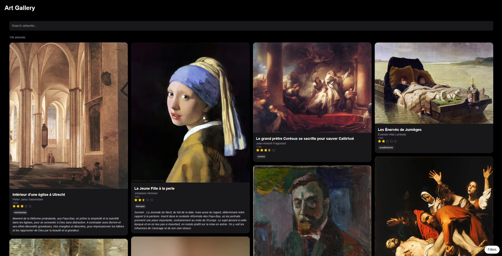

# ArtBook



Pour lancer le site (dev) :

```bash
npm run dev
```

Puis : [http://localhost:3000](http://localhost:3000).

Les images sont stockés dans un Cloudinary. La feuille excel
`public/artworks.xlsx` contient les métadonnées et l'url Cloudinary de ces
images.

Le site est déployé avec Vercel, sous l'url :
[vercel-app](https://artbook-gilt.vercel.app/).

## Utilisation

- `Ctrl-f` met le curseur dans la barre de recherche, où peuvent être recherchés
les noms des tableaux, les artistes, et les tags.
- `s` ouvre l'onglet des filtres. Ces filtres peuvent être accessibles à partir
de l'icone en bas à droite du site.
